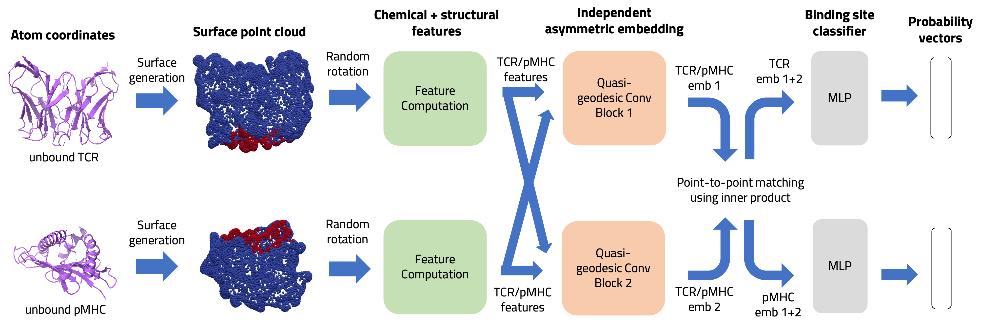

# TCR-pMHC Binding


### Data

Sequential TCR-pMHC data was obtained from:
 - Montemurro, A., Schuster, V., Povlsen, H.R. et al. NetTCR-2.0 enables accurate prediction of TCR-peptide binding by using paired TCRα and β sequence data. Commun Biol 4, 1060 (2021). [https://doi.org/10.1038/s42003-021-02610-3](https://www.nature.com/articles/s42003-021-02610-3)

 - Vita R, Mahajan S, Overton JA, Dhanda SK, Martini S, Cantrell JR, Wheeler DK, Sette A, Peters B. The Immune Epitope Database (IEDB): 2018 update. Nucleic Acids Res. 2018 Oct 24. doi: 10.1093/nar/gky1006. PMID: 30357391; PMCID: PMC6324067. [www.iedb.org](www.iedb.org)

 - Goncharov, M., Bagaev, D., Shcherbinin, D. et al. VDJdb in the pandemic era: a compendium of T cell receptors specific for SARS-CoV-2. Nat Methods 19, 1017–1019 (2022). [https://doi.org/10.1038/s41592-022-01578-0](https://www.nature.com/articles/s41592-022-01578-0)

 - Tickotsky N, Sagiv T, Prilusky J, Shifrut E, Friedman N (2017). McPAS-TCR: A manually-curated catalogue of pathology-associated T cell receptor sequences. Bioinformatics 33:2924-2929 [doi](http://friedmanlab.weizmann.ac.il/McPAS-TCR/)

### Structure Generation

3D TCR-pMHC complexes generated with Philip Bradley (2023) Structure-based prediction of T cell receptor:peptide-MHC interactions eLife 12:e82813
[https://doi.org/10.7554/eLife.82813](https://elifesciences.org/articles/82813)


### Model




Adapted from: Sverrisson, F., Feydy, J., Correia, B. E., & Bronstein, M. M. (2020). Fast end-to-end learning on protein surfaces. Proceedings of the IEEE/CVF Conference on Computer Vision and Pattern Recognition (CVPR), 2021, pp. 15272-15281
[link](https://openaccess.thecvf.com/content/CVPR2021/html/Sverrisson_Fast_End-to-End_Learning_on_Protein_Surfaces_CVPR_2021_paper.html)


### Usage
This project requires these specific versions. The `PyKeops` library is the bottleneck here. 
| Dependency | Version |
| ------------- | ------------- |
| GCC  | 9.2.0 |
| CMAKE | 3.22.2 |
| CUDA |  11.7 |
| cuDNN  | 7.6.x |
| Python | 3.8.16 |
| PyTorch | 1.13.1 |
| PyKeops | 2.1.1 |
| PyTorch Geometric | 2.2.0 |

setup:
```
$ pip install -e .
```


### Citation

Jean-Guillaume Brasier (Harvard IACS) & Marinka Zitnik (HMS DBMI)


